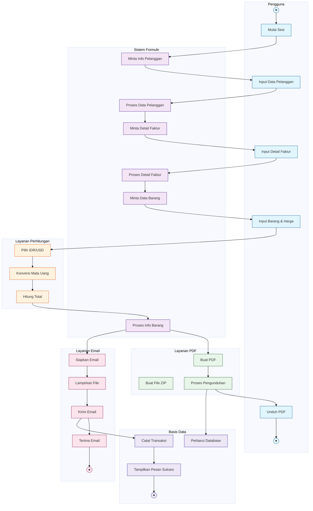

```mermaid
%%{init: {'theme': 'base', 'themeVariables': { 'fontSize': '16px'}}}%%
graph TD
    subgraph Pengguna[Pengguna]
        Start((●)) --> MulaiSesi[Mulai Sesi]
        InputPelanggan[Input Data Pelanggan]
        InputFaktur[Input Detail Faktur]
        InputBarang[Input Barang & Harga]
        UnduhPDF[Unduh PDF]
        UnduhPDF --> AkhirPengguna((●))
    end

    subgraph Formulir[Sistem Formulir]
        MintaDataPelanggan[Minta Info Pelanggan]
        ProsesPelanggan[Proses Data Pelanggan]
        MintaDetailFaktur[Minta Detail Faktur]
        ProsesDetail[Proses Detail Faktur]
        MintaBarang[Minta Data Barang]
        ProsesBarang[Proses Info Barang]
    end

    subgraph Perhitungan[Layanan Perhitungan]
        PilihMataUang[Pilih IDR/USD]
        KonversiMataUang[Konversi Mata Uang]
        HitungTotal[Hitung Total]
    end

    subgraph PDF[Layanan PDF]
        BuatPDF[Buat PDF]
        BuatZip[Buat File ZIP]
        ProsesPengunduhan[Proses Pengunduhan]
    end

    subgraph Email[Layanan Email]
        SiapkanEmail[Siapkan Email]
        LampirkanFile[Lampirkan File]
        KirimEmail[Kirim Email]
        TerimaEmail[Terima Email]
        TerimaEmail --> AkhirEmail((●))
    end

    subgraph Database[Basis Data]
        PerbaruiDB[Perbarui Database]
        CatatTransaksi[Catat Transaksi]
        TampilkanSukses[Tampilkan Pesan Sukses]
        TampilkanSukses --> AkhirDB((●))
    end

    %% Koneksi
    MulaiSesi --> MintaDataPelanggan
    MintaDataPelanggan --> InputPelanggan
    InputPelanggan --> ProsesPelanggan
    ProsesPelanggan --> MintaDetailFaktur
    MintaDetailFaktur --> InputFaktur
    InputFaktur --> ProsesDetail
    ProsesDetail --> MintaBarang
    MintaBarang --> InputBarang
    InputBarang --> PilihMataUang
    
    PilihMataUang --> KonversiMataUang
    KonversiMataUang --> HitungTotal
    HitungTotal --> ProsesBarang
    
    ProsesBarang --> BuatPDF
    ProsesBarang --> SiapkanEmail
    
    BuatPDF --> ProsesPengunduhan
    SiapkanEmail --> LampirkanFile
    LampirkanFile --> KirimEmail
    
    ProsesPengunduhan --> UnduhPDF
    KirimEmail --> TerimaEmail
    
    ProsesPengunduhan --> PerbaruiDB
    KirimEmail --> CatatTransaksi
    CatatTransaksi --> TampilkanSukses

    %% Styles
    classDef userAction fill:#e1f5fe,stroke:#01579b
    classDef formProcess fill:#f3e5f5,stroke:#4a148c
    classDef calcProcess fill:#fff3e0,stroke:#e65100
    classDef pdfProcess fill:#e8f5e9,stroke:#1b5e20
    classDef emailProcess fill:#fce4ec,stroke:#880e4f
    classDef dbProcess fill:#ede7f6,stroke:#311b92

    class Start,AkhirPengguna,MulaiSesi,InputPelanggan,InputFaktur,InputBarang,UnduhPDF userAction
    class MintaDataPelanggan,ProsesPelanggan,MintaDetailFaktur,ProsesDetail,MintaBarang,ProsesBarang formProcess
    class PilihMataUang,KonversiMataUang,HitungTotal calcProcess
    class BuatPDF,BuatZip,ProsesPengunduhan pdfProcess
    class SiapkanEmail,LampirkanFile,KirimEmail,TerimaEmail,AkhirEmail emailProcess
    class PerbaruiDB,CatatTransaksi,TampilkanSukses,AkhirDB dbProcess
```